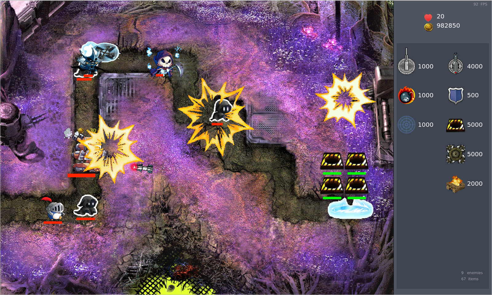
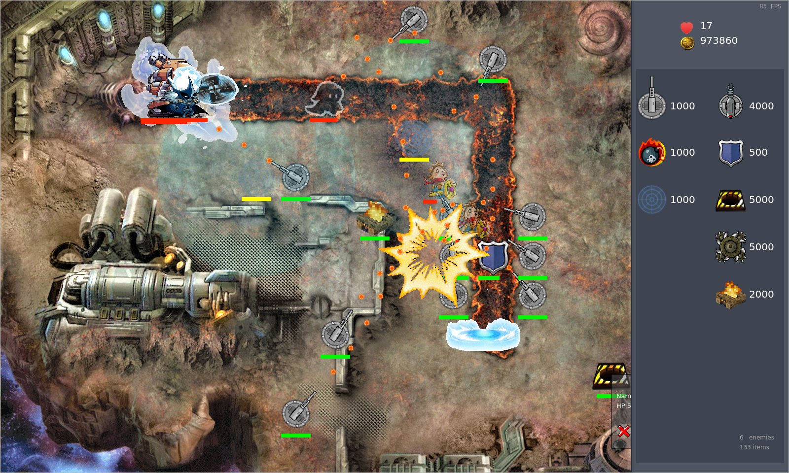

# TDGame

NJUCS 2021 年秋季学期《高级程序设计》课程项目：基于 Qt 实现的简单塔防小游戏

> [DeepWiki](https://deepwiki.com/Flying-Tom/TDGame/), 可供下载的 [Demo](https://github.com/Flying-Tom/TDGame/releases)

## 项目结构

采用了Qt的`Graphics View`框架

- 共有4张地图，7种防御塔和8种敌人
- 游戏内`ESC`返回主菜单，`F5`暂停

## 游戏截图

|   |   |
|---|---|
|||
|||

## 如何编译

执行 `scripts/build.sh` 脚本进行初始化编译, 后续在 `build` 目录下执行 `make` 相关命令即可

### 编译环境

- Qt >= 6.2.4
- Ubuntu
  - `build-essential` & `cmake`
  - `qt6-base-dev`, `qtmultimedia6-dev`
- Windows
  - [mingw](https://www.mingw-w64.org/)
