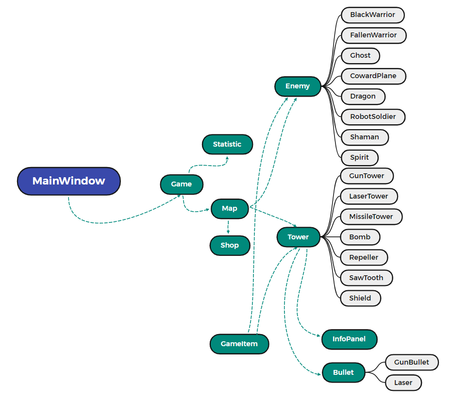
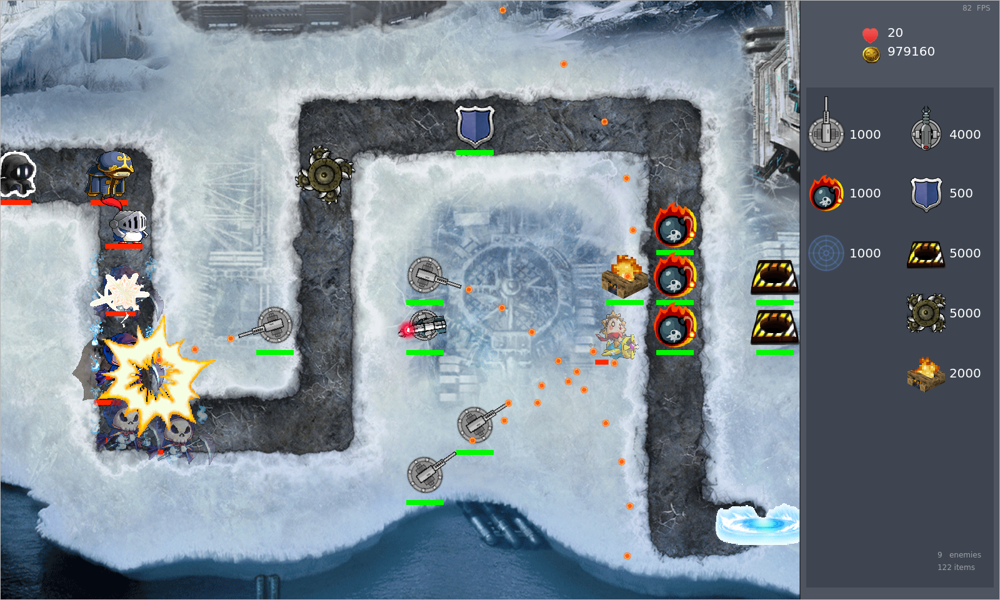
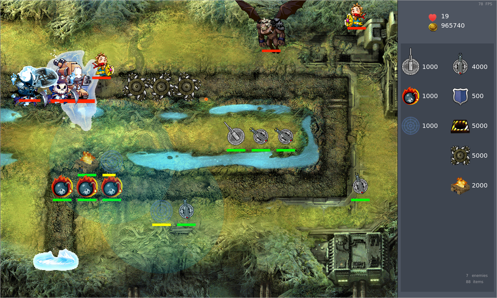
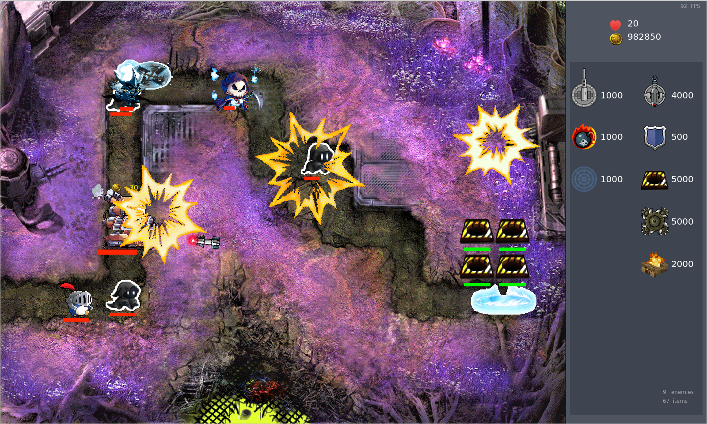
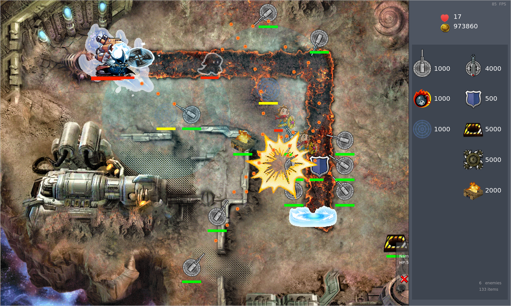

# TDGame

<p><a href="https://opensource.org/licenses/"></a><a href="https://t.me/BrokenTom"></a> <a href="https://github.com/Flying-Tom/TDGame/actions/workflows/release-windows.yml"></a> <a href="https://github.com/Flying-Tom/TDGame/actions/workflows/release-ubuntu.yml"></a></p>

2021年秋季学期《高级程序设计》课程项目：基于Qt库的简单塔防小游戏

已有通过Github Actions构建的[Demo](https://github.com/Flying-Tom/TDGame/releases)可供下载

## 项目结构



采用了Qt的Graphics View框架

- 蓝色框，即 `MainWindow`,表示的是应用的主窗口界面

- 绿色框表示当前类是继承于Qt的自定义基类，黑色框为其对应的子类。

- `Tower`和`Enemy`是继承于`GameItem`(将防御塔和敌人的共同特征做了较大程度的抽象)的派生类

- 绿色箭头表示被指向的一端是另一端的成员, 是绘图层面或者是对象组织层面上的父子关系 (类似于聚合)

> 更为具体的设计和游戏内容(单位介绍和实现功能等)可参见 具体的实验报告`doc/report.pdf`

## 游戏截图

4张地图，7种防御塔和8种敌人

- 游戏内`ESC`返回主菜单，`F5`暂停
- <s>游戏平衡做的稀巴烂 (不是怪太强就是塔太强)</s>
- 有一些个人风格比较强的不是很推荐的设计









## 编译环境

Qt &gt;= 5.12

Ubuntu

```
apt update
apt install cmake make g++ qt5-default qtmultimedia5-dev
```

Windows

- mingw Qt5.12
